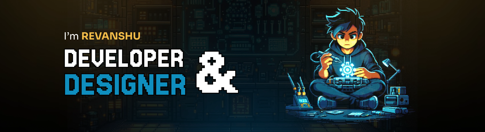

###

<h2 align="center">Hi 👋! My name is Revanshu Pusadkar   I'm a Developer & Designer, from Nagpur</h2>

###

  ✦ Currently working on <a href="https://codevantage.in/">Code Vantage</a> 👨🏼‍🎓 Learning about Backend & Robotics 👨🏼‍💻 Working as a web developer since 2024   <i>Trying to make an impact with my skills!!</i>

###

  
  
  
  

###

# 💻 Tech Stack:

###

  
  
  
  
  
  
  
  
  
  
  
  
  
  
  
  
  
  
  
  
  
  
  
  
  

###

# ⭐ Socials:

  
  
  

###

<picture>
  <source media="(prefers-color-scheme: dark)" srcset="https://raw.githubusercontent.com/Rey004/Rey004/output/github-snake-dark.svg" />
  <source media="(prefers-color-scheme: light)" srcset="https://raw.githubusercontent.com/Rey004/Rey004/output/github-snake.svg" />
  
</picture>
