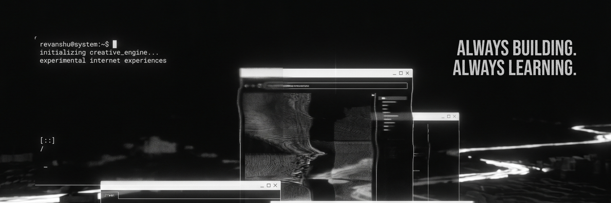

<!-- ══════════════ HERO BANNER ══════════════ -->
<p align="center">
  <a href="#">
    
</p>

<!-- ══════════════ INTRO ROW ══════════════ -->
<p>
  <a href="#">
    
  </a>
</p>

<p>
  <code>●&nbsp;online</code> &nbsp;
  <code>◐&nbsp;always&nbsp;tinkering</code> &nbsp;
  <code>◌&nbsp;open&nbsp;to&nbsp;collab</code>
</p>

<br clear="all"/>

<!-- ══════════════ ABOUT + PROJECTS SIDE BY SIDE ══════════════ -->
<table width="100%">
<tr>
<td valign="top" width="50%">

### `~ $ cat about.txt`

```txt
┌──────────────────────────────────────────────────┐
│  > hi, i'm revanshuu.                             │
│  > always trying to build fun things             │
│    that can wow people.                          │
│                                                  │
│  ─ tech · business                               │
│  ─ content creation                              │
│  ─ design / art                                  │
│  ─ night owl trying to become an early bird      │
│                                                  │
│  $ currently → DinoDash · chrome extension       │
│  $ learning  → soft skills + content creation    │
│  $ fueled by → music, workouts, late-night runs  │
│  $ location  → india // mostly online            │
└──────────────────────────────────────────────────┘
```

</td>
<td valign="top" width="50%">

### `~ $ ls projects/`

```txt
┌─ projects ───────────────────────────────────────┐
│  ▸ DinoDash/            ▒▒  building             │
│    chrome dino reimagined for your new tab       │
│                                                  │
│  ▸ Code-Vantage/        ▓▓  live                 │
│    3d interactive web design agency site         │
│                                                  │
│  ▸ ──────────/          ░░  coming soon          │
│    placeholder · slot reserved                   │
│                                                  │
│  ▸ ──────────/          ░░  coming soon          │
│    placeholder · slot reserved                   │
│                                                  │
│  status: 2 active  ·  ∞ in the backlog           │
└──────────────────────────────────────────────────┘
```

</td>
</tr>
</table>

<sub>
  ↳ open
  <a href="https://github.com/Rey004/DinoDash"><code>DinoDash</code></a>
  ·
  <a href="https://codevantage.in/"><code>Code-Vantage</code></a>
  &nbsp;·&nbsp;
  <a href="https://github.com/Rey004?tab=repositories">all repos →</a>
</sub>

<br/><br/>

<p align="center">
  <a href="https://github.com/Rey004">
    
  </a>
</p>

<p align="center">
  <a href="https://github.com/Rey004">
    
  </a>
</p>

<br/>

<picture>
  <source media="(prefers-color-scheme: dark)" srcset="https://raw.githubusercontent.com/Rey004/Rey004/output/github-snake-dark.svg" />
  <source media="(prefers-color-scheme: light)" srcset="https://raw.githubusercontent.com/Rey004/Rey004/output/github-snake.svg" />
  
</picture>

<!-- ══════════════ FOOTER WAVE ══════════════ -->
<p align="center">
  
</p>
